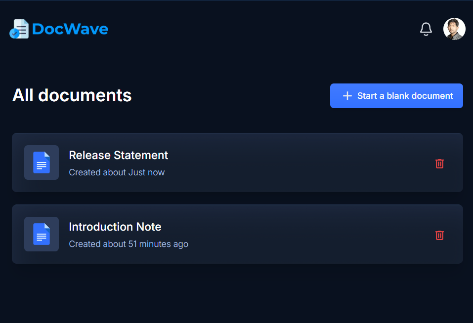

## 🔷 Introduction

**DocWave** - is an industry-ready web application for live, collaborative document creation. Built with Next.js for the user interface, Liveblocks for real-time collaboration, and styled with TailwindCSS.

 

## ⚙️ Tech Stack

-   Next.js
-   TypeScript
-   Liveblocks
-   Lexical Editor
-   ShadCN
-   Tailwind CSS

 

## 🔋 Features

👉 **Authentication**: Secure sign-in/out and session management using GitHub authentication via NextAuth.

👉 **Collaborative Text Editor**: Real-time collaboration allows multiple users to edit the same document simultaneously.

👉 **Document Management**

-   **Create Documents**: Easily create new documents with automatic saving and listing.
-   **Delete Documents**: Users can delete documents they own.
-   **Share Documents**: Share documents via email or link, with options for view or edit permissions.
-   **List Documents**: View all documents owned or shared with the user, with search and sorting features.

👉 **Comments**: Add inline or general comments with threaded discussions.

👉 **Active Collaborators**: Display active collaborators in the text editor with real-time presence indicators.

👉 **Notifications**: Receive notifications for document shares, new comments, and collaborator activities.

👉 **Responsive Design**: The application is fully responsive across all devices.

… and much more, including modular code architecture and reusability.

 

### Visit the live site : https://docwave.vercel.app
